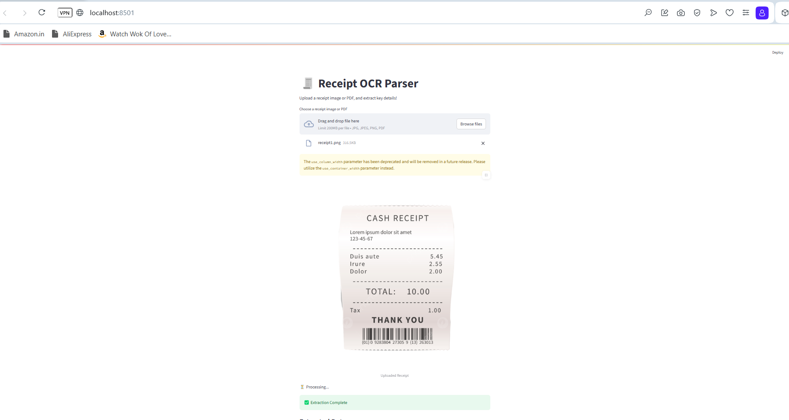

git add README.md
git commit -m "Add README.md"
git push
# 🧾 Receipt OCR App

An AI-powered web application that extracts **Vendor Name**, **Total Amount**, and **Date** from uploaded **receipt images or PDFs** using OCR (Optical Character Recognition).  
Built with **FastAPI** (backend), **Streamlit** (frontend), and **Tesseract OCR**.

---

## 🚀 Features

- ✅ Upload `.jpg`, `.png`, or `.pdf` receipts
- ✅ OCR-based text extraction using `pytesseract`
- ✅ Regex-based parsing to identify:
  - Vendor name
  - Total amount
  - Purchase date
- ✅ Streamlit UI for easy file uploads
- ✅ FastAPI backend with `/upload` endpoint
- ✅ Works with both image and PDF formats

---

## 🖼️ Demo



---

## 🛠️ Tech Stack

| Layer      | Technology       |
|------------|------------------|
| Frontend   | Streamlit        |
| Backend    | FastAPI + Uvicorn |
| OCR Engine | Tesseract OCR    |
| Parsing    | Regex + Python   |
| Language   | Python 3.10+     |

---

## 📦 Setup Instructions

### 🔧 1. Clone the repository

```bash
git clone https://github.com/bindhusreepothapi/Receipt-bill-app.git
cd Receipt-bill-app
